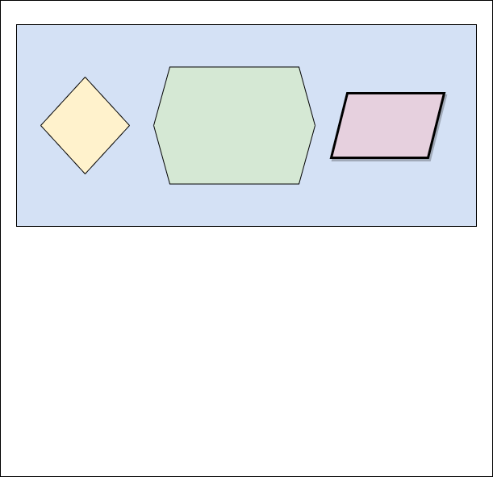

footer: @EncodePanda, paul.szulc@gmail.com
slidenumbers: true

# [fit] "Getting acquainted with __Lens__"

### @EncodePanda

---

# This talk is about __Lens__[^1]

1. What problem they are trying to solve?
2. How we can use them?
3. How they are being implemented?

[^1]: [https://hackage.haskell.org/package/lens](https://hackage.haskell.org/package/lens).

---

# There are two things fundamentally broken in Haskell

1. Record syntax
2. Strings

---

# There are two things fundamentally broken in Haskell

1. Record syntax
2. ~~Strings~~

---

# Record syntax broken?

> "The record system is a continual source of pain"
- Stephen Diehl

<!-- https://www.stephendiehl.com/posts/production.html -->

---

# Record syntax broken?

> "What is your least favorite thing about Haskell? Records are still tedious"
- 2018 State of Haskell Survey

---

# Record syntax broken?

> "Shitty records."
- Someone on reddit

---

# The Example

---

```haskell
data Conference = Conference
  { organizer :: Organizer
  , speakers  :: [Speaker]
  } deriving Show
```

---

```haskell
data Conference = Conference
  { organizer :: Organizer
  , speakers  :: [Speaker]
  } deriving Show

data Organizer = Organizer
  { name    :: Name
  , contact :: Contact
  } deriving Show
```

---

```haskell
data Organizer = Organizer
  { name    :: Name
  , contact :: Contact
  } deriving Show
```

---

[.code-highlight: 2,5-9]

```haskell
data Organizer = Organizer
  { name    :: Name
  , contact :: Contact
  } deriving Show

data Name = Name
  { firstName :: String
  , lastName  :: String
  } deriving Show
```

---

[.code-highlight: 3,5-9]

```haskell
data Organizer = Organizer
  { name    :: Name
  , contact :: Contact
  } deriving Show

data Contact = Contact
  { address :: Address
  , email   :: String
  } deriving Show
```

---

```haskell
data Address = Address
  { street  :: String
  , city    :: String
  , country :: String
  } deriving Show
```

---

```haskell
data Conference = Conference
  { organizer :: Organizer
  , speakers  :: [Speaker]
  } deriving Show
```

---
[.code-highlight: 3,6-8]

```haskell
data Conference = Conference
  { organizer :: Organizer
  , speakers  :: [Speaker]
  } deriving Show

data Speaker = Speaker
  { slidesReady :: Bool
  } deriving Show
```

---

# Getting things from a record

---

```haskell
data Conference = Conference
  { organizer :: Organizer
  , speakers  :: [Speaker]
  } deriving Show

oli :: Organizer
oli = Organizer
  { name = Name "Oli" "Makhasoeva"
  , contact = classified
  }
```

---
[.code-highlight: 8]

```haskell
data Conference = Conference
  { organizer :: Organizer
  , speakers  :: [Speaker]
  } deriving Show

oli :: Organizer
oli = Organizer
  { name = Name "Oli" "Makhasoeva"
  , contact = classified
  }
```

---

```haskell
data Conference = Conference
  { organizer :: Organizer
  , speakers  :: [Speaker]
  } deriving Show
```

```haskell
λ> :t name
name :: Organizer -> Name
```

---

```haskell
data Conference = Conference
  { organizer :: Organizer
  , speakers  :: [Speaker]
  } deriving Show
```

```haskell
λ> name oli
Name {firstName = "Oli", lastName = "Makhasoeva"}
```

---

[.code-highlight: 1]
```haskell
import Data.Function ((&))

λ> :t (&)
(&) :: a -> (a -> b) -> b
λ> length [4, 6, 8]
3
λ> [4, 6, 8] & length
3
```

---

[.code-highlight: 1-4]
```haskell
import Data.Function ((&))

λ> :t (&)
(&) :: a -> (a -> b) -> b
λ> length [4, 6, 8]
3
λ> [4, 6, 8] & length
3
```

---

[.code-highlight: 1-6]
```haskell
import Data.Function ((&))

λ> :t (&)
(&) :: a -> (a -> b) -> b
λ> length [4, 6, 8]
3
λ> [4, 6, 8] & length
3
```

---

```haskell
import Data.Function ((&))

λ> :t (&)
(&) :: a -> (a -> b) -> b
λ> length [4, 6, 8]
3
λ> [4, 6, 8] & length
3
```

---

```haskell
data Conference = Conference
  { organizer :: Organizer
  , speakers  :: [Speaker]
  } deriving Show
```

```haskell
λ> name oli
Name {firstName = "Oli", lastName = "Makhasoeva"}
```

---

```haskell
data Conference = Conference
  { organizer :: Organizer
  , speakers  :: [Speaker]
  } deriving Show
```

```haskell
λ> oli & name
Name {firstName = "Oli", lastName = "Makhasoeva"}
```

---

```haskell
data Conference = Conference
  { organizer :: Organizer
  , speakers  :: [Speaker]
  } deriving Show
```

```haskell
λ> oli & name & firstName
"Oli"
```

---

```haskell
organizerCountry :: Conference -> String
organizerCountry conf =
  conf & organizer
       & contact
	   & address
	   & country
```

---

# But

---

```haskell
data Conference = Conference
  { organizer :: Organizer
  , speakers  :: [Speaker]
  } deriving Show

data Organizer = Organizer
  { name    :: Name
  , contact :: Contact
  } deriving Show

data Speaker = Speaker
  { slidesReady :: Bool
  } deriving Show
```

---

```haskell
data Conference = Conference
  { name      :: String
  , organizer :: Organizer
  , speakers  :: [Speaker]
  } deriving Show

data Organizer = Organizer
  { name    :: Name
  , contact :: Contact
  } deriving Show

data Speaker = Speaker
  { name        :: Name
  , slidesReady :: Bool
  } deriving Show
```

---

[.code-highlight: 2,8,13]

```haskell
data Conference = Conference
  { name      :: String
  , organizer :: Organizer
  , speakers  :: [Speaker]
  } deriving Show

data Organizer = Organizer
  { name    :: Name
  , contact :: Contact
  } deriving Show

data Speaker = Speaker
  { name        :: Name
  , slidesReady :: Bool
  } deriving Show
```

---

```haskell
/../src/WhyLens.hs:27:5: error:
    Multiple declarations of ‘name’
    Declared at: src/WhyLens.hs:12:5
                 src/WhyLens.hs:27:5
   |
27 |   { name        :: Name
   |
```

---


---

# [fit] {-# LANGUAGE DuplicateRecordFields #-}

---

[.code-highlight: 2-18]
```haskell
{-# LANGUAGE DuplicateRecordFields #-}
module WhyLens where

data Conference = Conference
  { name      :: String
  , organizer :: Organizer
  , speakers  :: [Speaker]
  } deriving Show

data Organizer = Organizer
  { name    :: Name
  , contact :: Contact
  } deriving Show

data Speaker = Speaker
  { name        :: Name
  , slidesReady :: Bool
  } deriving Show
```

---

```haskell
{-# LANGUAGE DuplicateRecordFields #-}
module WhyLens where

data Conference = Conference
  { name      :: String
  , organizer :: Organizer
  , speakers  :: [Speaker]
  } deriving Show

data Organizer = Organizer
  { name    :: Name
  , contact :: Contact
  } deriving Show

data Speaker = Speaker
  { name        :: Name
  , slidesReady :: Bool
  } deriving Show
```

---

# But

---

```haskell
organizerName :: Conference -> Name
organizerName conference =
  conference & organizer & name
```

---

```
/../src/WhyLens.hs:69:28: error:
    Ambiguous occurrence ‘name’
    It could refer to
       either the field ‘name’, defined at src/WhyLens.hs:34:5
           or the field ‘name’, defined at src/WhyLens.hs:19:5
           or the field ‘name’, defined at src/WhyLens.hs:13:5
```

---


---

# [fit] {-# LANGUAGE OverloadedLabels      #-}

---


---

```haskell
{-# LANGUAGE DataKinds             #-}
{-# LANGUAGE DuplicateRecordFields #-}
{-# LANGUAGE FlexibleInstances     #-}
{-# LANGUAGE MultiParamTypeClasses #-}
{-# LANGUAGE OverloadedLabels      #-}
```

---
[.code-highlight: 1-2]

```haskell
class IsLabel (x :: Symbol) a where
  fromLabel :: a

instance IsLabel "encodepanda" Speaker where
  fromLabel = Speaker
    { name = Name "Pawel" "Szulc"
    , slidesReady = False
    }

pawel :: Speaker
pawel = fromLabel @"encodepanda"
```

---
[.code-highlight: 1-8]

```haskell
class IsLabel (x :: Symbol) a where
  fromLabel :: a

instance IsLabel "encodepanda" Speaker where
  fromLabel = Speaker
    { name = Name "Pawel" "Szulc"
    , slidesReady = False
    }

pawel :: Speaker
pawel = fromLabel @"encodepanda"
```

---

```haskell
class IsLabel (x :: Symbol) a where
  fromLabel :: a

instance IsLabel "encodepanda" Speaker where
  fromLabel = Speaker
    { name = Name "Pawel" "Szulc"
    , slidesReady = False
    }

pawel :: Speaker
pawel = fromLabel @"encodepanda"
```

---

[.code-highlight: 10-11]

```haskell
class IsLabel (x :: Symbol) a where
  fromLabel :: a

instance IsLabel "encodepanda" Speaker where
  fromLabel = Speaker
    { name = Name "Pawel" "Szulc"
    , slidesReady = False
    }

pawel :: Speaker
pawel = fromLabel @"encodepanda"
```

---

[.code-highlight: 10-11]
```haskell
class IsLabel (x :: Symbol) a where
  fromLabel :: a

instance IsLabel "encodepanda" Speaker where
  fromLabel = Speaker
    { name = Name "Pawel" "Szulc"
    , slidesReady = False
    }

pawel :: Speaker
pawel = #encodepanda
```

---

```haskell
organizerName :: Conference -> Name
organizerName conference =
  conference & organizer & name
```

---

```
/../src/WhyLens.hs:69:28: error:
    Ambiguous occurrence ‘name’
    It could refer to
       either the field ‘name’, defined at src/WhyLens.hs:34:5
           or the field ‘name’, defined at src/WhyLens.hs:19:5
           or the field ‘name’, defined at src/WhyLens.hs:13:5
```

---

[.code-highlight: 2,8,13]

```haskell
data Conference = Conference
  { name      :: String
  , organizer :: Organizer
  , speakers  :: [Speaker]
  } deriving Show

data Organizer = Organizer
  { name    :: Name
  , contact :: Contact
  } deriving Show

data Speaker = Speaker
  { name        :: Name
  , slidesReady :: Bool
  } deriving Show
```

---

[.code-highlight: 1-4]

```haskell
data Organizer = Organizer
  { name    :: Name
  , contact :: Contact
  } deriving Show

instance IsLabel "name" (Organizer -> Name) where
   fromLabel = name
```

---

```haskell
data Organizer = Organizer
  { name    :: Name
  , contact :: Contact
  } deriving Show

instance IsLabel "name" (Organizer -> Name) where
   fromLabel = name
```

---

```haskell
data Organizer = Organizer
  { name    :: Name
  , contact :: Contact
  } deriving Show

instance IsLabel "name" (Organizer -> Name) where
   fromLabel = name

organizerName :: Conference -> Name
organizerName conference =
  conference & organizer & name
```
---

```haskell
data Organizer = Organizer
  { name    :: Name
  , contact :: Contact
  } deriving Show

instance IsLabel "name" (Organizer -> Name) where
   fromLabel = name

organizerName :: Conference -> Name
organizerName conference =
  conference & organizer & #name
```

---


---


---

# Setting things to a record

---

[.code-highlight: 1]

```haskell
λ> haskellLove
Conference
  { name = "Haskell.Love"
  , organizer = Organizer {..}
  , speakers = []
  }
```
---

```haskell
λ> haskellLove
Conference
  { name = "Haskell.Love"
  , organizer = Organizer {..}
  , speakers = []
  }
```

---

[.code-highlight: 1]

```haskell
λ> haskellLove { speakers = [ pawel, marcin ] }
Conference
  { name = "Haskell.Love"
  , organizer = Organizer {..}
  , speakers = [ Speaker { name = Name { firstName = "Pawel"
			             , lastName = "Szulc"}
			             , slidesReady = False
				     	 }
               , Speaker { name = Name { firstName = "Marcin"
				         , lastName = "Rzeznicki"}
				         , slidesReady = False}
				  	     ]
  }
```
---

```haskell
λ> haskellLove { speakers = [ pawel, marcin ] }
Conference
  { name = "Haskell.Love"
  , organizer = Organizer {..}
  , speakers = [ Speaker { name = Name { firstName = "Pawel"
			             , lastName = "Szulc"}
			             , slidesReady = False
				     	 }
               , Speaker { name = Name { firstName = "Marcin"
				         , lastName = "Rzeznicki"}
				         , slidesReady = False}
				  	     ]
  }
```

---
# But

---
[.code-highlight: 1]
```haskell
allSpeakersNotReady :: Conference -> Conference
allSpeakersNotReady conference =
  let
    oldSpeakers = conference & speakers
  in
    conference {
      speakers =
	    fmap (\s -> s { slidesReady = False}) oldSpeakers
    }
```

---
[.code-highlight: 1-2, 6-10]
```haskell
allSpeakersNotReady :: Conference -> Conference
allSpeakersNotReady conference =
  let
    oldSpeakers = conference & speakers
  in
    conference {
      speakers =
	    fmap (\s -> s { slidesReady = False}) oldSpeakers
    }
```

---

```haskell
allSpeakersNotReady :: Conference -> Conference
allSpeakersNotReady conference =
  let
    oldSpeakers = conference & speakers
  in
    conference {
      speakers =
	    fmap (\s -> s { slidesReady = False}) oldSpeakers
    }
```

---

[.code-highlight: 1]
```haskell
changeOrganizerEmail :: (String -> String) -> Conference ->  Conference
changeOrganizerEmail modifyEmail conference =
  let
    oldOrganizer = conference & organizer
    newContact = (oldOrganizer & contact)
      { email = modifyEmail (oldOrganizer & contact & email)
      }
    newOrganizer = oldOrganizer { contact = newContact}
  in
    conference { organizer = newOrganizer }
```

---

[.code-highlight: 1-2]
```haskell
changeOrganizerEmail :: (String -> String) -> Conference ->  Conference
changeOrganizerEmail modifyEmail conference =
  let
    oldOrganizer = conference & organizer
    newContact = (oldOrganizer & contact)
      { email = modifyEmail (oldOrganizer & contact & email)
      }
    newOrganizer = oldOrganizer { contact = newContact}
  in
    conference { organizer = newOrganizer }
```

---

[.code-highlight: 1-2,10]
```haskell
changeOrganizerEmail :: (String -> String) -> Conference ->  Conference
changeOrganizerEmail modifyEmail conference =
  let
    oldOrganizer = conference & organizer
    newContact = (oldOrganizer & contact)
      { email = modifyEmail (oldOrganizer & contact & email)
      }
    newOrganizer = oldOrganizer { contact = newContact}
  in
    conference { organizer = newOrganizer }
```

---
[.code-highlight: 1-2,8-10]
```haskell
changeOrganizerEmail :: (String -> String) -> Conference ->  Conference
changeOrganizerEmail modifyEmail conference =
  let
    oldOrganizer = conference & organizer
    newContact = (oldOrganizer & contact)
      { email = modifyEmail (oldOrganizer & contact & email)
      }
    newOrganizer = oldOrganizer { contact = newContact}
  in
    conference { organizer = newOrganizer }
```

---
[.code-highlight: 1-2,5-10]
```haskell
changeOrganizerEmail :: (String -> String) -> Conference ->  Conference
changeOrganizerEmail modifyEmail conference =
  let
    oldOrganizer = conference & organizer
    newContact = (oldOrganizer & contact)
      { email = modifyEmail (oldOrganizer & contact & email)
      }
    newOrganizer = oldOrganizer { contact = newContact}
  in
    conference { organizer = newOrganizer }
```

---
```haskell
changeOrganizerEmail :: (String -> String) -> Conference ->  Conference
changeOrganizerEmail modifyEmail conference =
  let
    oldOrganizer = conference & organizer
    newContact = (oldOrganizer & contact)
      { email = modifyEmail (oldOrganizer & contact & email)
      }
    newOrganizer = oldOrganizer { contact = newContact}
  in
    conference { organizer = newOrganizer }
```

---


---
[.build-lists: true]
# What can you do about it

1. Change the programming language
2. Quit
3. Ask the Oracle

---


---

# __Lens__[^1]

[^1]: [https://hackage.haskell.org/package/lens](https://hackage.haskell.org/package/lens).

---


---


---


---


---


___


___


___


___


___


___


___


___


___


___


___


___


___


___


___


___


___


___


---

# Lens' s a

---
```haskell
_organizer :: Lens' Conference Organizer
```

---
```haskell
_organizer :: Lens' Conference Organizer

λ> view _organizer haskellLove
Organizer
  { name = Name { firstName = "Oli"
                , lastName = "Makhasoeva"}
  , contact = Contact {..}
  }
```

---
```haskell
_organizer :: Lens' Conference Organizer

λ> haskellLove ^. _organizer
Organizer
  { name = Name { firstName = "Oli"
                , lastName = "Makhasoeva"}
  , contact = Contact {..}
  }
```

---
[.code-highlight: 1-4]

```haskell
_organizer :: Lens' Conference Organizer
_contact :: Lens' Organizer Contact
_address :: Lens' Contact Address
_country :: Lens' Address String

λ> haskelllove ^. _organizer . _contact . _address . _country
"classified"
```

---
[.code-highlight: 1-4]

```haskell
_organizer :: Lens' Conference Organizer
_contact ::              Lens' Organizer Contact
_address ::                       Lens' Contact Address
_country ::                              Lens' Address String

λ> haskelllove ^. _organizer . _contact . _address . _country
"classified"
```

---
[.code-highlight: 1-4]

```haskell
_organizer :: Lens' Conference Organizer
_contact :: Lens' Organizer Contact
_address :: Lens' Contact Address
_country :: Lens' Address String

λ> haskelllove ^. _organizer . _contact . _address . _country
"classified"
```

---
```haskell
_organizer :: Lens' Conference Organizer
_contact :: Lens' Organizer Contact
_address :: Lens' Contact Address
_country :: Lens' Address String

λ> haskelllove ^. _organizer . _contact . _address . _country
"classified"
```

---

# dot?

---

```haskell
(.) :: (b -> c) -> (a -> b) -> a -> c
```

# How is that possible?

---


---
```haskell
_organizer :: Lens' Conference Organizer
_contact :: Lens' Organizer Contact
_address :: Lens' Contact Address
_country :: Lens' Address String

λ> haskelllove ^. _organizer . _contact . _address . _country
"classified"
```

---
```haskell
_name :: Lens' Conference String

λ> set _name "Haskell Love 2020" haskellLove
Conference
  { name = "Haskell Love 2020"
  , organizer = Organizer {..}
  , speakers = [..]
  }
```

---
```haskell
_name :: Lens' Conference String

λ> (_name .~ "Haskell Love 2020") haskellLove
Conference
  { name = "Haskell Love 2020"
  , organizer = Organizer {..}
  , speakers = [..]
  }
```

---
```haskell
_name :: Lens' Conference String

λ> haskellLove & _name .~ "Haskell Love 2020"
Conference
  { name = "Haskell Love 2020"
  , organizer = Organizer {..}
  , speakers = [..]
  }
```

---
[.code-highlight: 1-4]
```haskell
_organizer :: Lens' Conference Organizer
_contact :: Lens' Organizer Contact
_address :: Lens' Contact Address
_country :: Lens' Address String

λ> haskellLove & _organizer . _contact . _address . _country .~ "Poland"
Conference
  { name = "Haskell.Love"
  , organizer =
      Organizer { name = Name {firstName = "Oli", lastName = "Makhasoeva"}
                , contact = Contact { address = Address { street = "Class"
		     	                                        , city = "ified"
						    		                    , country = "Poland"
														}
                , email = "oli@haskell.love"}
				}
  , speakers = [...]
  }
```

---
[.code-highlight: 1-6]
```haskell
_organizer :: Lens' Conference Organizer
_contact :: Lens' Organizer Contact
_address :: Lens' Contact Address
_country :: Lens' Address String

λ> haskellLove & _organizer . _contact . _address . _country .~ "Poland"
Conference
  { name = "Haskell.Love"
  , organizer =
      Organizer { name = Name {firstName = "Oli", lastName = "Makhasoeva"}
                , contact = Contact { address = Address { street = "Class"
		     	                                        , city = "ified"
						    		                    , country = "Poland"
														}
                , email = "oli@haskell.love"}
				}
  , speakers = [...]
  }
```
---
```haskell
_organizer :: Lens' Conference Organizer
_contact :: Lens' Organizer Contact
_address :: Lens' Contact Address
_country :: Lens' Address String

λ> haskellLove & _organizer . _contact . _address . _country .~ "Poland"
Conference
  { name = "Haskell.Love"
  , organizer =
      Organizer { name = Name {firstName = "Oli", lastName = "Makhasoeva"}
                , contact = Contact { address = Address { street = "Class"
		     	                                        , city = "ified"
						    		                    , country = "Poland"
														}
                , email = "oli@haskell.love"}
				}
  , speakers = [...]
  }
```
---
[.code-highlight: 6,13]
```haskell
_organizer :: Lens' Conference Organizer
_contact :: Lens' Organizer Contact
_address :: Lens' Contact Address
_country :: Lens' Address String

λ> haskellLove & _organizer . _contact . _address . _country .~ "Poland"
Conference
  { name = "Haskell.Love"
  , organizer =
      Organizer { name = Name {firstName = "Oli", lastName = "Makhasoeva"}
                , contact = Contact { address = Address { street = "Class"
		     	                                        , city = "ified"
						    		                    , country = "Poland"
														}
                , email = "oli@haskell.love"}
				}
  , speakers = [...]
  }
```

---
```haskell
_organizer :: Lens' Conference Organizer
_contact :: Lens' Organizer Contact
_address :: Lens' Contact Address
_country :: Lens' Address String

λ> haskellLove & _organizer . _contact . _address . _country .~ "Poland"
Conference
  { name = "Haskell.Love"
  , organizer =
      Organizer { name = Name {firstName = "Oli", lastName = "Makhasoeva"}
                , contact = Contact { address = Address { street = "Class"
		     	                                        , city = "ified"
						    		                    , country = "Poland"
														}
                , email = "oli@haskell.love"}
				}
  , speakers = [...]
  }
```

---
```haskell
_organizer :: Lens' Conference Organizer
_contact :: Lens' Organizer Contact
_address :: Lens' Contact Address
_country :: Lens' Address String

λ> haskellLove & _organizer . _contact . _address . _country .~ "Poland"
               & _name .~ "Haskell Love 2021"
Conference
  { name = "Haskell Love 2021"
  , organizer =
      Organizer { name = Name {firstName = "Oli", lastName = "Makhasoeva"}
                , contact = Contact { address = Address { street = "Class"
		     	                                        , city = "ified"
						    		                    , country = "Poland"
														}
                , email = "oli@haskell.love"}
				}
  , speakers = [...]}
```

---
[.code-highlight: 6-7,9,14]

```haskell
_organizer :: Lens' Conference Organizer
_contact :: Lens' Organizer Contact
_address :: Lens' Contact Address
_country :: Lens' Address String

λ> haskellLove & _organizer . _contact . _address . _country .~ "Poland"
               & _name .~ "Haskell Love 2021"
Conference
  { name = "Haskell Love 2021"
  , organizer =
      Organizer { name = Name {firstName = "Oli", lastName = "Makhasoeva"}
                , contact = Contact { address = Address { street = "Class"
		     	                                        , city = "ified"
						    		                    , country = "Poland"
														}
                , email = "oli@haskell.love"}
				}
  , speakers = [...]}
```

---
[.code-highlight: 1-4]

```haskell
_organizer :: Lens' Conference Organizer
_contact :: Lens' Organizer Contact
_address :: Lens' Contact Address
_country :: Lens' Address String

λ> haskellLove & _organizer . _contact . _address . _country .~ "Poland"
               & _name .~ "Haskell Love 2021"
Conference
  { name = "Haskell Love 2021"
  , organizer =
      Organizer { name = Name {firstName = "Oli", lastName = "Makhasoeva"}
                , contact = Contact { address = Address { street = "Class"
		     	                                        , city = "ified"
						    		                    , country = "Poland"
														}
                , email = "oli@haskell.love"}
				}
  , speakers = [...]}
```

---
[.code-highlight: 4-7]
```haskell
{-# LANGUAGE TemplateHaskell #-}
module TheLens where

data Ticket = Ticket
  { _event :: String
  , _price :: Int
  } deriving Show

makeLenses ''Ticket

λ> ticket = Ticket "Haskell Love" 0
λ> ticket ^. price
0
λ> ticket & event .~ "Haskell Love 2020"
Ticket {_event = "Haskell Love 2020", _price = 0}
```
---
[.code-highlight: 1-2,4-7]
```haskell
{-# LANGUAGE TemplateHaskell #-}
module TheLens where

data Ticket = Ticket
  { _event :: String
  , _price :: Int
  } deriving Show

makeLenses ''Ticket

λ> ticket = Ticket "Haskell Love" 0
λ> ticket ^. price
0
λ> ticket & event .~ "Haskell Love 2020"
Ticket {_event = "Haskell Love 2020", _price = 0}
```
---
[.code-highlight: 1-2,4-9]
```haskell
{-# LANGUAGE TemplateHaskell #-}
module TheLens where

data Ticket = Ticket
  { _event :: String
  , _price :: Int
  } deriving Show

makeLenses ''Ticket

λ> ticket = Ticket "Haskell Love" 0
λ> ticket ^. price
0
λ> ticket & event .~ "Haskell Love 2020"
Ticket {_event = "Haskell Love 2020", _price = 0}
```
---
[.code-highlight: 1-2,4-11]
```haskell
{-# LANGUAGE TemplateHaskell #-}
module TheLens where

data Ticket = Ticket
  { _event :: String
  , _price :: Int
  } deriving Show

makeLenses ''Ticket

λ> ticket = Ticket "Haskell Love" 0
λ> ticket ^. price
0
λ> ticket & event .~ "Haskell Love 2020"
Ticket {_event = "Haskell Love 2020", _price = 0}
```

---
[.code-highlight: 1-2,4-13]
```haskell
{-# LANGUAGE TemplateHaskell #-}
module TheLens where

data Ticket = Ticket
  { _event :: String
  , _price :: Int
  } deriving Show

makeLenses ''Ticket

λ> ticket = Ticket "Haskell Love" 0
λ> ticket ^. price
0
λ> ticket & event .~ "Haskell Love 2020"
Ticket {_event = "Haskell Love 2020", _price = 0}
```

---
```haskell
{-# LANGUAGE TemplateHaskell #-}
module TheLens where

data Ticket = Ticket
  { _event :: String
  , _price :: Int
  } deriving Show

makeLenses ''Ticket

λ> ticket = Ticket "Haskell Love" 0
λ> ticket ^. price
0
λ> ticket & event .~ "Haskell Love 2020"
Ticket {_event = "Haskell Love 2020", _price = 0}
```

---

# generic-lens [^2]


[^2]: [https://hackage.haskell.org/package/generic-lens](https://hackage.haskell.org/package/generic-lens).
